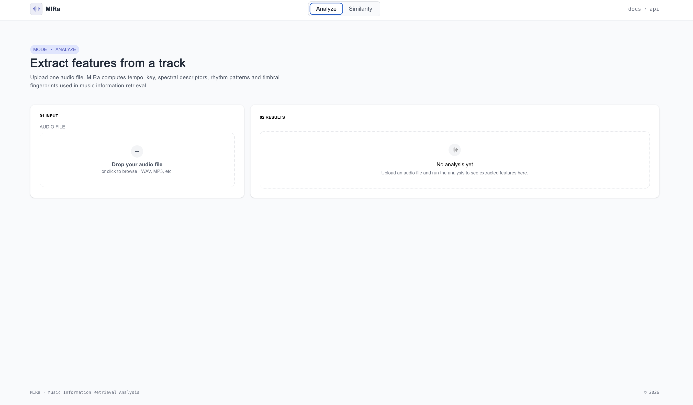
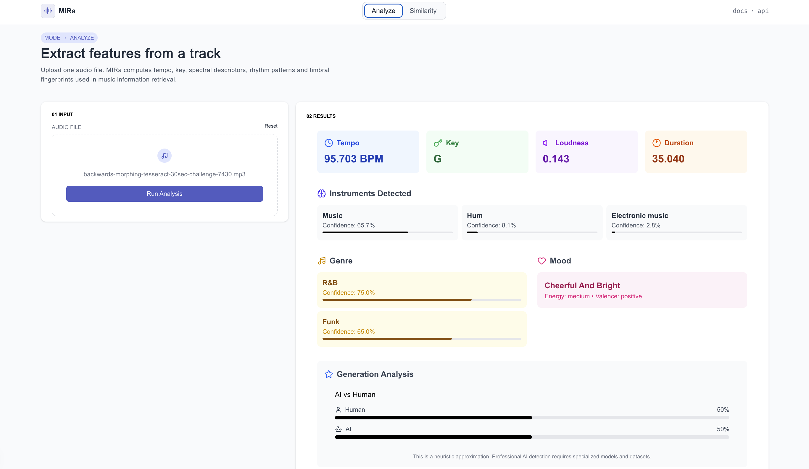
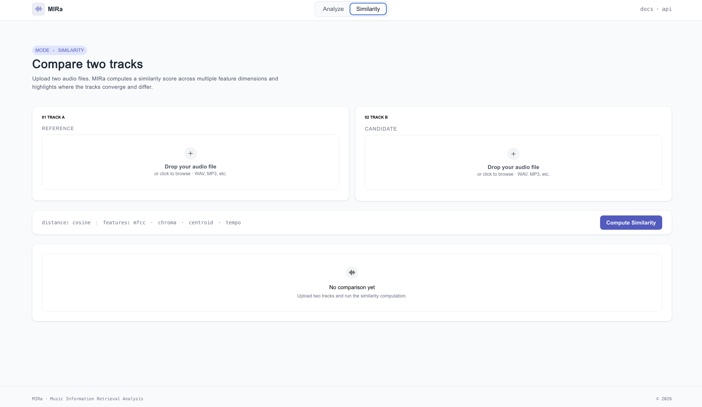
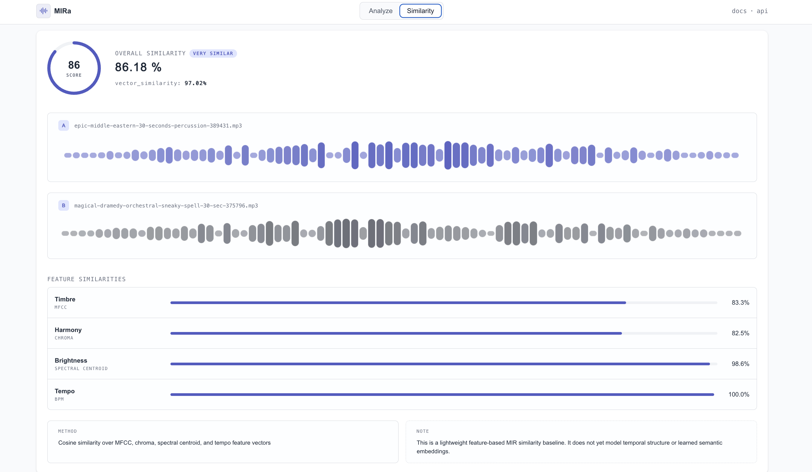

# MIRa — Music Information Retrieval Analysis

> A research-oriented prototype exploring how audio features and ML models can be combined into usable music analysis and similarity systems.

 
 

**[Live Demo](https://mir-a.vercel.app)** · **[API Docs (Hugging Face Spaces)](https://anuouseph-mira-music-analysis-api.hf.space/docs)**

---

## TL;DR

- Upload a music file → extract semantic audio features (tempo, key, genre, mood, spectral descriptors)
- Compare two tracks → compute weighted cosine similarity across MFCC, chroma, spectral, and tempo vectors
- Combines Librosa signal processing + Transformer-based classification
- Deployed end-to-end: FastAPI on Hugging Face Spaces + Next.js on Vercel

---

## Overview

MIRa is a music analysis prototype built to explore how audio signal processing and machine learning models can be combined into a practical, usable interface. The system has two modes:
 
**Analyze** — accepts a single audio file and returns a structured set of features covering tonal, rhythmic, timbral, and affective dimensions of the track.
 
**Compare** — accepts two audio files and computes a weighted similarity score across multiple feature dimensions, highlighting where tracks converge and differ at a per-feature level.
 
The project is motivated by core MIR research tasks — automatic annotation, genre classification, mood inference, and music similarity — and serves as a foundation for further work in recommendation and retrieval.

---

## Features

### Analysis

| Feature | Method | Output |
|---|---|---|
| Tempo | Librosa beat tracking | BPM |
| Musical Key | Chroma-based key estimation | Key name |
| Loudness | RMS energy analysis | Normalized value |
| Duration | Audio metadata | Seconds |
| Instrument Detection | Hugging Face audio classifier | Label + confidence % |
| Genre Classification | Transformer-based model | Top genres + confidence % |
| Mood / Affect | Valence-arousal heuristics | Label, energy, valence |
| AI vs Human Detection | Experimental spectral heuristic | Human/AI probability % |

### Similarity
| Feature Vector | Representation | Weight |
|---|---|---|
| Timbre (MFCC) | Mean + std over 13 coefficients | 50% |
| Harmony (Chroma) | Mean + std over 12 pitch classes | 30% |
| Brightness (Spectral Centroid) | Mean + std | 15% |
| Rhythm (Tempo) | Single scalar | 5% |
 
Overall similarity is a weighted combination of per-feature cosine similarities. Raw vector similarity (unweighted concatenation) is also returned for comparison.

---

## Technical Approach
 
**Signal Processing Layer** — Low-level features are extracted using Librosa: beat tracking for tempo, chroma STFT for key estimation, RMS for loudness, and spectral descriptors (centroid, rolloff, flatness, ZCR). All features are computed on the raw waveform loaded at 22050 Hz. For similarity, features are aggregated as mean + standard deviation vectors over the first 30 seconds of audio, producing fixed-size representations regardless of track length.
 
**Classification Layer** — Higher-level semantic features (genre, instrument, mood) use pretrained Hugging Face Transformer models operating on mel-spectrogram representations.
 
**Similarity Method** — Cosine similarity is computed independently per feature group, then combined using explicit weights that reflect their perceptual importance (MFCC → timbre → strongest signal; tempo → weakest). The weighting is a deliberate design choice, not implicit in vector size.
 
**Limitations** — Genre classification performs well for broad categories but struggles with subgenre distinction, a known challenge (Tzanetakis & Cook, 2002). The AI detection module is an experimental heuristic and does not represent a production solution. The similarity method is a classical baseline — it does not model temporal structure or use learned semantic embeddings.
 
---

## System Architecture
 
```
Audio File (MP3/WAV)
      │
      ▼
┌──────────────────────────────────┐
│         FastAPI Backend           │
│  ┌────────────────────────────┐  │
│  │   Signal Processing        │  │  ← Librosa: tempo, key, loudness
│  │   (analyzer.py)            │  │
│  ├────────────────────────────┤  │
│  │   ML Classification        │  │  ← HF Transformers: genre, mood , instrument
│  │   (services/)              │  │
│  ├────────────────────────────┤  │
│  │   Similarity Engine        │  │  ← Cosine similarity, weighted scoring
│  │   (services/similarity.py) │  │
│  └────────────────────────────┘  │
│   REST API: /analyze /compare-audio│
└──────────────────────────────────┘
      │
      ▼
┌──────────────────────────────────┐
│       Next.js Frontend            │
│   Analyze mode + Compare mode     │
└──────────────────────────────────┘
```
 
---

## Stack

| Layer | Technology |
|---|---|
| Backend | Python 3.10, FastAPI, Uvicorn |
| Signal Processing | Librosa, NumPy, SoundFile |
| ML Models | Hugging Face Transformers, Torch |
| Audio I/O | FFmpeg, libsndfile |
| Frontend | Next.js 14, React, Tailwind CSS |
| Deployment | Hugging Face Spaces (Docker) + Vercel |

---

## Running Locally

**Backend**
```bash
cd backend
python -m venv venv && source venv/bin/activate
pip install -r requirements.txt
# FFmpeg required: brew install ffmpeg (macOS) or apt install ffmpeg (Linux)
uvicorn main:app --reload
# API docs at http://localhost:7860/docs
```

**Frontend**
```bash
cd frontend
npm install
# Set NEXT_PUBLIC_API_URL=http://localhost:3000 in .env.local
npm run dev
```

---

## Planned Extensions

- **Music similarity** — cosine distance over MFCC/chroma vectors for track comparison
- **Automatic annotation evaluation** — benchmark against GTZAN dataset with accuracy reporting
- **Waveform & spectrogram visualization** — display audio features visually in the frontend using WaveSurfer.js
- **Recommendation prototype** — nearest-neighbour search over a feature vector index

---

## References

- Tzanetakis, G. & Cook, P. (2002). Musical genre classification of audio signals. *IEEE Transactions on Speech and Audio Processing.*
- McFee, B. et al. (2015). librosa: Audio and music signal analysis in Python. *Proceedings of the 14th Python in Science Conference.*
- Défossez, A. et al. (2022). High fidelity neural audio compression. *arXiv:2210.13438.*

---

[Portfolio](https://anuouseph.vercel.app) · [LinkedIn](https://linkedin.com/in/anuouseph) · [GitHub](https://github.com/AnuOuseph)