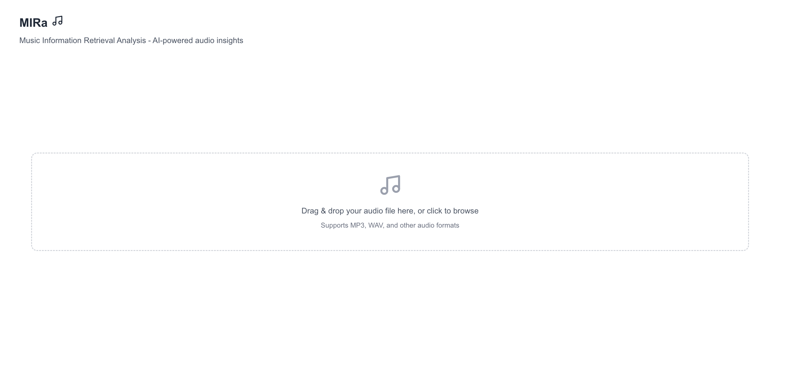
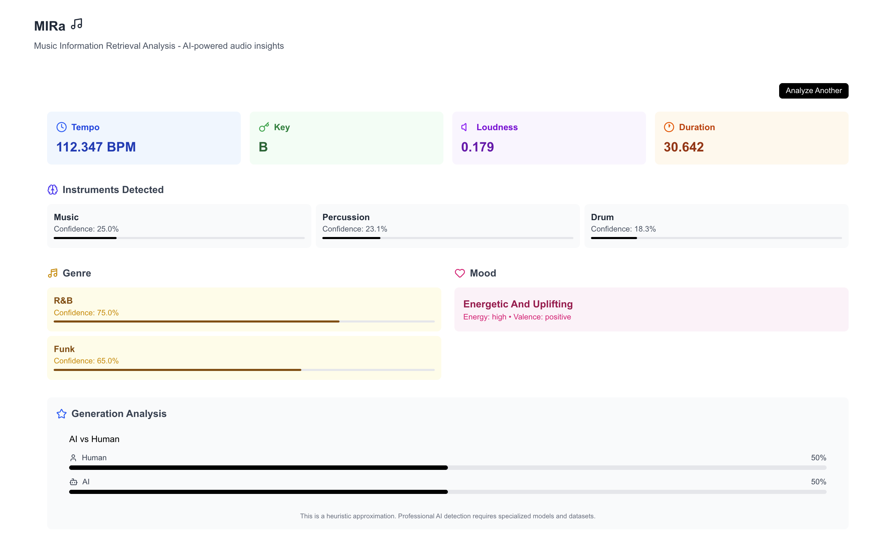

# MIRa — Music Information Retrieval Analysis

> A research-oriented prototype exploring how audio features and ML models can be combined into usable music analysis and retrieval systems.




**[Live Demo](https://mir-a.vercel.app)** · **[API (Hugging Face Spaces)](https://anuouseph-mira-music-analysis-api.hf.space/docs)**

---

## TL;DR

- Upload a music file → get semantic audio features (tempo, key, genre, mood)
- Combines Librosa signal processing + Transformer-based classification
- Deployed end-to-end (FastAPI + Next.js)
- Currently being extended toward music similarity and retrieval

---

## Overview

MIRa is a music analysis prototype built to explore how audio signal processing and machine learning models can be combined into a practical, usable interface. The system accepts an audio file and returns a structured set of features covering tonal, rhythmic, timbral, and affective dimensions of the track.

The project is motivated by core MIR research tasks — automatic annotation, genre classification, mood inference, and generative AI detection — and serves as a foundation for further work in music similarity and recommendation.

---

## Features Extracted

| Feature | Method | Output |
|---|---|---|
| Tempo | Librosa beat tracking | BPM |
| Musical Key | Chroma-based key estimation | Key name |
| Loudness | RMS energy analysis | Normalized value |
| Duration | Audio metadata | Seconds |
| Instrument Detection | Hugging Face audio classifier | Label + confidence % |
| Genre Classification | Transformer-based model | Top genres + confidence % |
| Mood / Affect | Valence-arousal heuristics | Label, energy, valence |
| AI vs Human Detection | Experimental spectral heuristic | Human/AI probability % |

---

## Technical Approach

**Signal Processing Layer** — Low-level features such as tempo, key, and loudness are extracted using Librosa. This includes beat tracking, chroma-based analysis, and RMS energy computation on the raw audio waveform. These methods are well-established in MIR and provide interpretable and reproducible outputs.

**Classification Layer** — Higher-level semantic features (genre, instrument, mood) are produced using pretrained Hugging Face Transformer models. These operate on mel-spectrogram representations of the audio to infer perceptual and categorical attributes.

**Limitations & Future Work** — The current genre classification performs well for broad categories but struggles with fine-grained subgenres, which is a known limitation in MIR literature (Tzanetakis & Cook, 2002). The AI detection module is an experimental heuristic based on spectral patterns and does not represent a production-level solution. Future work will extend the system toward music similarity by computing distances over MFCC and chroma feature vectors, enabling track comparison and basic recommendation workflows.

---

## System Architecture

```
Audio File (MP3/WAV)
      │
      ▼
┌─────────────────────────────┐
│     FastAPI Backend          │
│  ┌──────────────────────┐   │
│  │  Signal Processing   │   │  ← Librosa: tempo, key, loudness
│  │  (analyzer.py)       │   │
│  ├──────────────────────┤   │
│  │  ML Classification   │   │  ← HF Transformers: genre, instrument, mood
│  │  (HF Pipelines)      │   │
│  └──────────────────────┘   │
│     REST API /analyze        │
└─────────────────────────────┘
      │
      ▼
┌─────────────────────────────┐
│   Next.js Frontend           │
│   Feature Visualization      │  ← Confidence scores, genre bars, mood labels
└─────────────────────────────┘
```

---

## Stack

| Layer | Technology |
|---|---|
| Backend | Python 3.10, FastAPI, Uvicorn |
| Signal Processing | Librosa, NumPy, SoundFile |
| ML Models | Hugging Face Transformers, Torch |
| Audio I/O | FFmpeg, libsndfile |
| Frontend | Next.js 14, React, Tailwind CSS |
| Deployment | Hugging Face Spaces (Docker) + Vercel |

---

## Running Locally

**Backend**
```bash
cd backend
python -m venv venv && source venv/bin/activate
pip install -r requirements.txt
# FFmpeg required: brew install ffmpeg (macOS) or apt install ffmpeg (Linux)
uvicorn main:app --reload
# API docs at http://localhost:7860/docs
```

**Frontend**
```bash
cd frontend
npm install
# Set NEXT_PUBLIC_API_URL=http://localhost:3000 in .env.local
npm run dev
```

---

## Planned Extensions

- **Music similarity** — cosine distance over MFCC/chroma vectors for track comparison
- **Automatic annotation evaluation** — benchmark against GTZAN dataset with accuracy reporting
- **Waveform & spectrogram visualization** — display audio features visually in the frontend using WaveSurfer.js
- **Recommendation prototype** — nearest-neighbour search over a feature vector index

---

## References

- Tzanetakis, G. & Cook, P. (2002). Musical genre classification of audio signals. *IEEE Transactions on Speech and Audio Processing.*
- McFee, B. et al. (2015). librosa: Audio and music signal analysis in Python. *Proceedings of the 14th Python in Science Conference.*
- Défossez, A. et al. (2022). High fidelity neural audio compression. *arXiv:2210.13438.*

---

[Portfolio](https://anuouseph.vercel.app) · [LinkedIn](https://linkedin.com/in/anuouseph) · [GitHub](https://github.com/AnuOuseph)