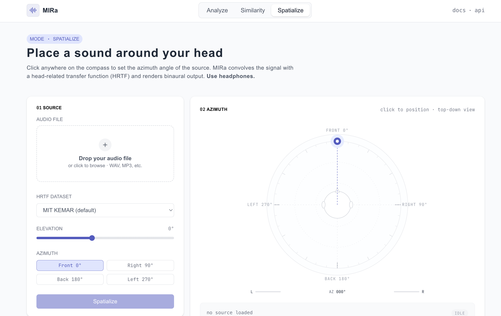
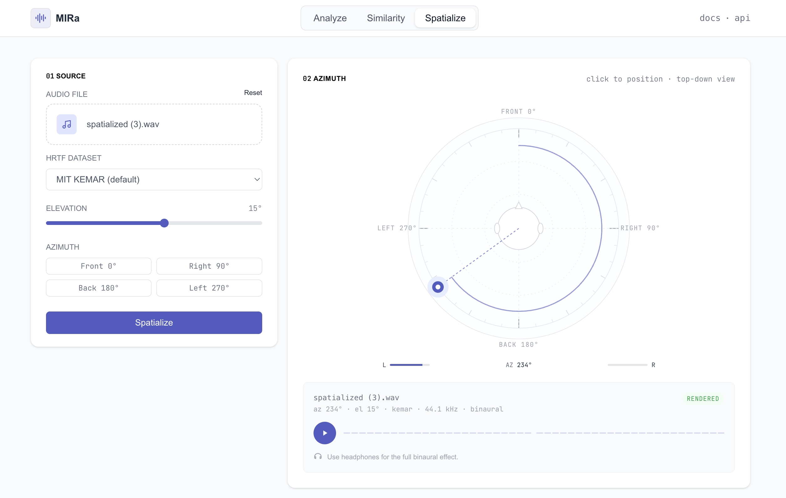
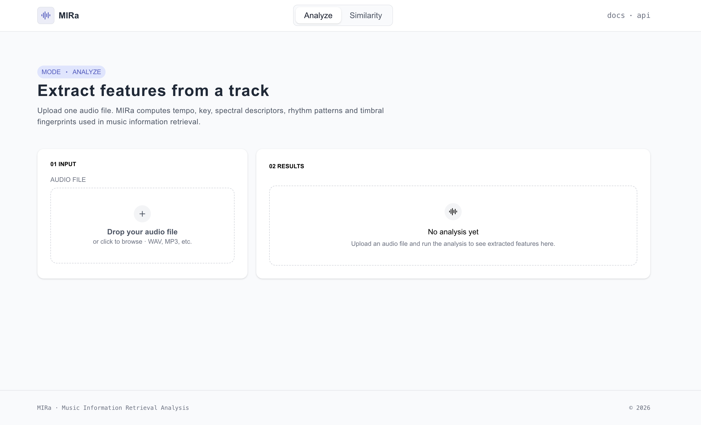
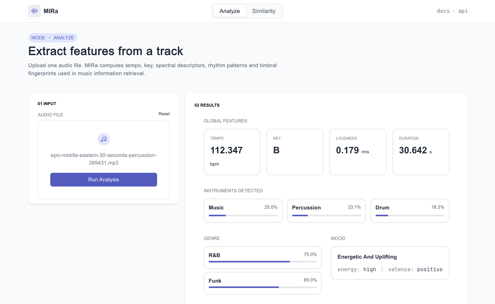
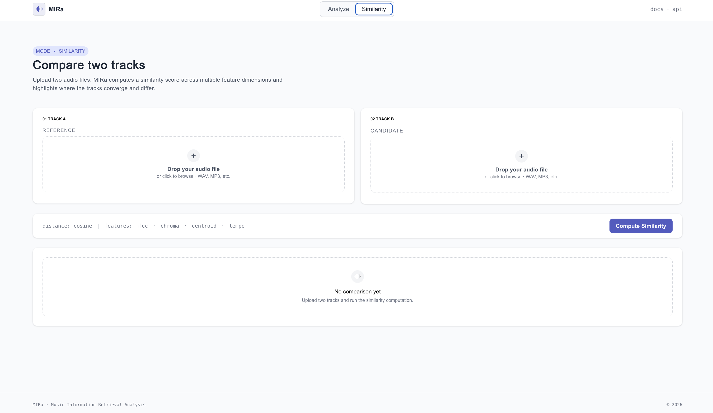
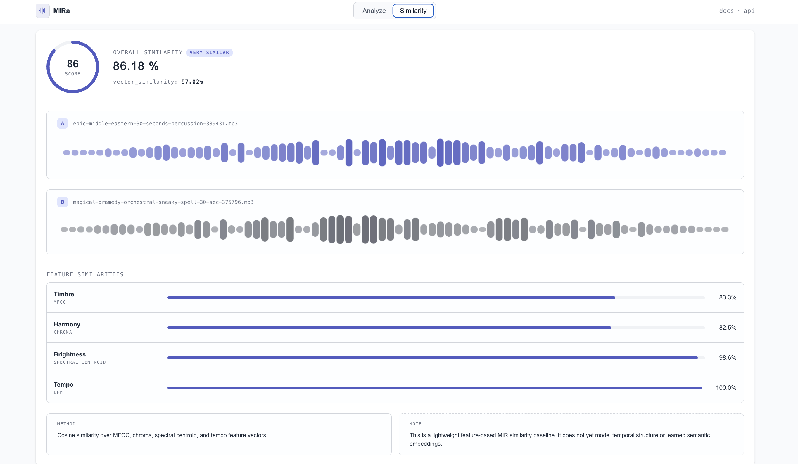

# MIRa — Music Information Retrieval Analysis

> A research-oriented prototype for extracting, comparing, and spatializing audio — combining classical signal processing with transformer-based classification and binaural synthesis.

 
 
 

**[Live Demo](https://mir-a.vercel.app)** · **[API Docs (Hugging Face Spaces)](https://anuouseph-mira-music-analysis-api.hf.space/docs)**

---

## Modules
 
MIRa has three modes:
 
**Analyze** — extract semantic audio features from a single track (tempo, key, genre, mood, instruments).
 
**Compare** — compute weighted similarity between two tracks across MFCC, chroma, spectral centroid, and tempo feature vectors.
 
**Spatialize** — render a mono audio file binaurally based on a selected direction. Upload a file, pick an azimuth on an interactive compass, and hear the sound positioned around your head through headphones.

---

## Features

### Binaural Synthesis
 
A spatial audio engine built from first principles and extended with measured HRTF data.
 
**What's implemented:**
 
- Audio decoding pipeline — WAV input, mono conversion, resampling to 44.1 kHz
- Synthetic HRTF engine — Woodworth ITD formula, frequency-dependent ILD head shadow model, pinna spectral shaping via FFT notch filters
- MIT KEMAR dataset integration 
- FFT convolution engine using SciPy `fftconvolve`, stereo encoding to 16-bit WAV
- FastAPI endpoint with dataset selection (synthetic vs KEMAR), validation, and error handling
- Interactive compass UI — click or drag to position the source, live L/R gain meters, binaural bar visualizer, status-aware player

**Limitations:**
 
- Offline processing only — no real-time streaming
- Generic HRTF (not individualised), so front/back and elevation cues are subtle for some listeners
- WAV input only, MP3 not yet supported
- Mobile UI not yet optimized
---
 
### Analysis Features
 
| Feature | Method | Output |
|---|---|---|
| Tempo | Librosa beat tracking | BPM |
| Musical Key | Chroma-based key estimation | Key + confidence |
| Loudness | RMS energy analysis | LUFS value |
| Duration | Audio metadata | Seconds |
| Perceptual Features | Energy, danceability, valence, acousticness | Normalized 0–1 |
| Instrument Detection | Hugging Face audio classifier | Label + confidence % |
| Genre Classification | Transformer-based model | Top genres + confidence % |
| Mood / Affect | Valence-arousal heuristics | Label, energy, valence |
 
---
 
### Similarity Method
 
| Feature Vector | Representation | Weight |
|---|---|---|
| Timbre (MFCC) | Mean + std over 13 coefficients | 50% |
| Harmony (Chroma) | Mean + std over 12 pitch classes | 30% |
| Brightness (Spectral Centroid) | Mean + std | 15% |
| Rhythm (Tempo) | Single scalar | 5% |
 
Overall similarity is a weighted combination of per-feature cosine similarities. Raw vector similarity (unweighted concatenation) is also returned for comparison.
 
---

## Stack
 
| Layer | Technology |
|---|---|
| Backend | Python 3.10, FastAPI, Uvicorn |
| Signal Processing | Librosa, NumPy, SciPy |
| ML Models | Hugging Face Transformers, PyTorch |
| Binaural | SciPy fftconvolve, MIT KEMAR HRTFs |
| Frontend | Next.js 14, React, Tailwind CSS |
| Deployment | Hugging Face Spaces (Docker) + Vercel |
 
---

## Running Locally

**Backend**
```bash
cd backend
python -m venv venv && source venv/bin/activate
pip install -r requirements.txt
# FFmpeg required: brew install ffmpeg (macOS) or apt install ffmpeg (Linux)
uvicorn main:app --reload
# API docs at http://localhost:8000/docs
```

**KEMAR HRTFs**
 
Download the MIT KEMAR dataset and place in `backend/hrtf/kemar/`:
```
https://github.com/imclab/libAudio3D/tree/master/data/MIT-KEMAR-HRTFs
```

**Frontend**
```bash
cd frontend
npm install
# Set NEXT_PUBLIC_API_URL=http://localhost:3000 in .env.local
npm run dev
```

---

## Planned Extensions

- **Automatic annotation evaluation** — benchmark against GTZAN dataset with accuracy reporting
- **Waveform & spectrogram visualization** — display audio features visually in the frontend using WaveSurfer.js
- **Recommendation prototype** — nearest-neighbour search over a feature vector index

---

## References

- Tzanetakis, G. & Cook, P. (2002). Musical genre classification of audio signals. *IEEE Transactions on Speech and Audio Processing.*
- McFee, B. et al. (2015). librosa: Audio and music signal analysis in Python. *Proceedings of the 14th Python in Science Conference.*
- Défossez, A. et al. (2022). High fidelity neural audio compression. *arXiv:2210.13438.*
- Gardner, W. & Martin, K. (1995). HRTF measurements of a KEMAR dummy-head microphone. *MIT Media Lab Technical Report.* — [MIT KEMAR Dataset](http://sound.media.mit.edu/resources/KEMAR.html)
- Wefers, F. (2015). Partitioned convolution algorithms for real-time auralization. *Doctoral dissertation, RWTH Aachen University.* — Partitioned FFT-based HRTF processing
- Møller, H. (1992). Fundamentals of binaural technology. *Applied Acoustics, 36(3-4), 171-218.* — Binaural rendering theory

---

[Portfolio](https://anuouseph.vercel.app) · [LinkedIn](https://linkedin.com/in/anuouseph) · [GitHub](https://github.com/AnuOuseph)